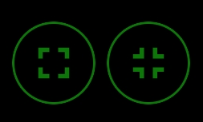
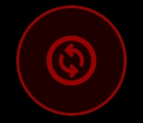

<div align="center">


# Dragon Launcher - Fast Gesture based android launcher

### Dragon Launcher is a highly customizable Android launcher focused on speed and efficiency.


[](https://github.com/Elnix90/Dragon-Launcher/releases/latest)
[](https://github.com/Elnix90/Dragon-Launcher/releases)

[](https://github.com/Elnix90/Dragon-Launcher/releases/latest)
[](https://apt.izzysoft.de/fdroid/index/apk/org.elnix.dragonlauncher)
</div>


## Features

### The main Idea of this launcher is to launch your apps via gestures.

* You can customize your list of fast access apps easily in the settings
* Use the app drawer to pick an app and browse apps

### Gestures & Actions

* Configurable swipe actions
* Drawer enter key actions
* Fast access app launching
* Gesture-first navigation with minimal UI clutter

### App Drawer

* Swipe-down to close drawer
* Configurable enter key behavior
* App shortcuts support (when provided by apps)
* Tap or long-press for quick actions

### Status Bar

* **Fully customizable**
* Optional visibility per user preference
* Custom time and date formatting
* Next alarm display
* Visual integration with launcher theme

### Appearance

* Deep customization features
* Customize each colors separately for every little action / surface
* Change wallpaper, apply blur, separate wallpaper on drawer / main screen
* Icon packs support
* Widgets support, arrange freely your widgets as well as floating apps / actions from Dragon

### Backup
* Manual backups to phone's storage
* Auto backup feature : auto backups on every app focus change


## Privacy & security

* **No** data collection
* Dragon Launcher has not even access to internet -> it cannot steal your data
* No intrusive permissions requested for the app to work
* Uses Accessibility permissions (optionally) to:
  1. Expand notifications panel (needed by android)
     - Uses accessibility to expand the notifications panel
     - Expanding the quick actions / notifications isn't required on some android version, there is a hidden settings in the debug tab, to change the way it opens the quick actions, cause on my phone, the notifications action opens que quick actions
  2. Lock screen (needed by android)
     - It uses accessibility to lock the screen, as you pressed the lock button
  3. Open recent apps (needed by android)
     - You can choose to open the recent apps, just like when you click on the Square button, or do the recent apps gesture
  4. Auto launch Dragon on system launcher detected (used by some Xiaomi users that cannot set another default launcher without loosing the gesture navigation)
     - It will launch Dragon Launcher when the accessibility detects that you entered your system launcher, for a default launcher-like experience when it cannot be set as android default (configurable in debug settings)
* Can set the Launcher as device admin
  * used for some OEMs o prevent it from killing the app, especially on Xiaomi/ HyperOS devices that have really strong battery optimisation features
  * used also for users that need the previous auto launch on system launcher, to prevent the accessibility services to be killed
* All data stored locally (you can backup manually or use the auto backup feature)

---
## Screenshots
<p align="center">
    
</p>

<p align="center">
  
  
  
  
  
  
  
  
  
  
  
  
  
  
  
  
</p>

## Usage

* **Long click 3 seconds to access settings**
* Tap or long-press apps to quickly launch, view options, or uninstall on drawer
* Customize gestures and visual settings via the Settings menu.
* Change background for main screen / drawer, add blur to it

---

### What's this icon ?

| Icons    | Meaning |
| -------- | ------- |
|   | Enter / Exit the nest (click before on the nest you created on one circle)    |
|  | Edit toggle between points and swipe distance.     |
|     | Toggle points snapping (if not enabled, you can move freely the points, else they snap in rounded position - 15°)    |
|     | Toggle auto-separate points when you drag them    |


## Signing

Releases signing key (SHA-256):

```text
63068d94e01eeae50efcb2a0c43dfa8ac503a421cdeaf353d45b69ab933c0a06
```

Verify: 
```bash 
apksigner verify --print-certs DragonLauncher-*.apk
```

F-droid signing key (SHA-256):
```text
Coming soon - not yet approved
```

## Credits

* Dragon Launcher was inspired by [CCLauncher](https://github.com/mlm-games/CCLauncher). Some concepts, features, and code structures are adapted from this project

## Contributing

* Contributions are welcome! Feel free to submit pull requests or open issues.

* You may join the [discord server](https://discord.gg/XXKXQeXpvF) to discuss more easily about changes in the project:

---
## License

* This project is open-source under the **GPL 3 Licence**.
